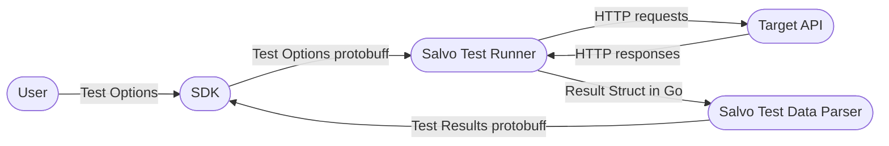

# Salvo Load Tester (pre release)

## Description
Salvo is a load testing library and application for testing load testing web APIs. 
The base layer of salvo is written in [Go](http://go.dev) and aims to utilize 
the power of the Go runtime and concurrency model to provide a load tester that is fast
and effective. 

## Project Goals
- [ ] Provide a load testing library that is easy to use and extend
- [ ] Provide SDKs for common languages to make load testing easy for any developer
- [ ] Provide a CLI application for running load tests
- [ ] Provide a local web application for running load tests
- [ ] Create a paid cloud service for running load tests at scale

## How Salvo Works
### Load Testing
Salvo's base load testing library is written in Go and uses goroutines to run concurrent simulated users. The simulated users make requests to the target API at a set rate and provide information about each call. Salvo then parses the request information and returns 
it to the user in a digestible format.

### SDKs
Salvo aims to provide SDKs for common languages to make load testing easy for any developer. 
The SDKs will provide a simple interface for creating load tests and running them
locally or in the cloud.
The SDKs will act as a wrapper around the base Go binary and will pass the options 
specified by the user to the binary using protocol buffers, through standard in.
The SDK will then read then receive the parsed results as protocol buffers 
through standard out. 


### Browser Application
Salvo aims to provide a browser application for running load tests locally. 
The web application will be written using the JavaScript SDK and [React](https://react.dev/). 
The web application will provide a simple interface for creating load tests 
and running them locally. The browser application will run locally on the user's machine using [Vite](https://vitejs.dev/). 

### Web Application
Salvo aims to provide a web application for running load tests in the cloud. 
The web version of Salvo will be a copy of the browser application, but will
run on a server and will be accessible through a web browser. The web application
will be a paid service and will use [AWS](https://aws.amazon.com/) to run load tests at scale.

### CLI Application
Salvo aims to provide a CLI application for running load tests locally or in the cloud.
The CLI application will be written in Go and will use the base load testing library.
The CLI application will be written using [Cobra](https://cobra.dev/), 
[Bubble Tea](https://github.com/charmbracelet/bubbletea),
and [Lip Gloss](https://github.com/charmbracelet/lipgloss).
The CLI application will be a wrapper around the base load testing library 
and will be the only part of the base application that will use anything outside of 
the Go standard library.

## Demo
To see a quick demo of Salvo, clone the repo and run the following commands:
```shell
cd demo
go run demo
```
This will run a quick cli demo that will allow you to run a load test on the url 
of your choice.
You will be prompted to enter the url you would like to test,
the number of simulated users you would like to use, 
the rate at which you would like the simulated users to make requests,
the time before requests should timeout, and the duration of the test.
